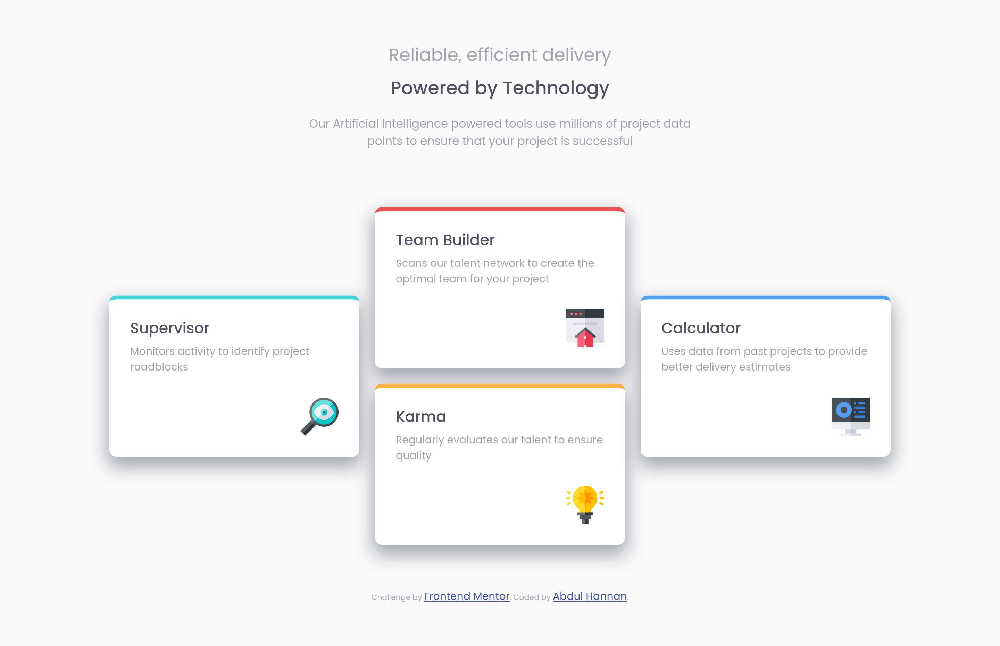
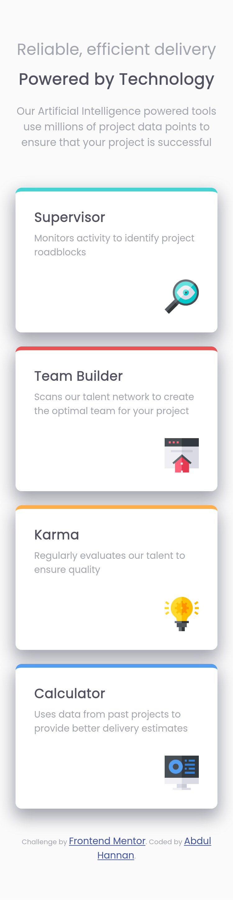

# Frontend Mentor - Four card feature section solution

This is a solution to the [Four card feature section challenge on Frontend Mentor](https://www.frontendmentor.io/challenges/four-card-feature-section-weK1eFYK). Frontend Mentor challenges help you improve your coding skills by building realistic projects. 

## Table of contents

- [Overview](#overview)
  - [The challenge](#the-challenge)
  - [Screenshot](#screenshot)
  - [Links](#links)
- [My process](#my-process)
  - [Built with](#built-with)
  - [What I learned](#what-i-learned)
  - [Continued development](#continued-development)
- [Author](#author)

**Note: Delete this note and update the table of contents based on what sections you keep.**

## Overview

### The challenge

Users should be able to:

- View the optimal layout for the site depending on their device's screen size

### Screenshot

 
Desktop Layout

 
Mobile Layout

### Links

- Solution URL: [Github](https://github.com/AbdulHannan123456/Four-Card-Feauture-Section)
- Live Site URL: [Github Pages](https://abdulhannan123456.github.io/Four-Card-Feauture-Section/)

## My process

### Built with

- Semantic HTML5 markup
- Flexbox
- CSS Grid
- Mobile-first workflow
- Media Queries

### What I learned

It gave me a better idea an integrating CSS grid with Flexbox.

### Continued development

I want to work on my CSS Grids and Flexbox styles. I also want to work on using other measurement units other than pixels.

## Author

- Frontend Mentor - [@AbdulHannan123456](https://www.frontendmentor.io/profile/AbdulHannan123456)
